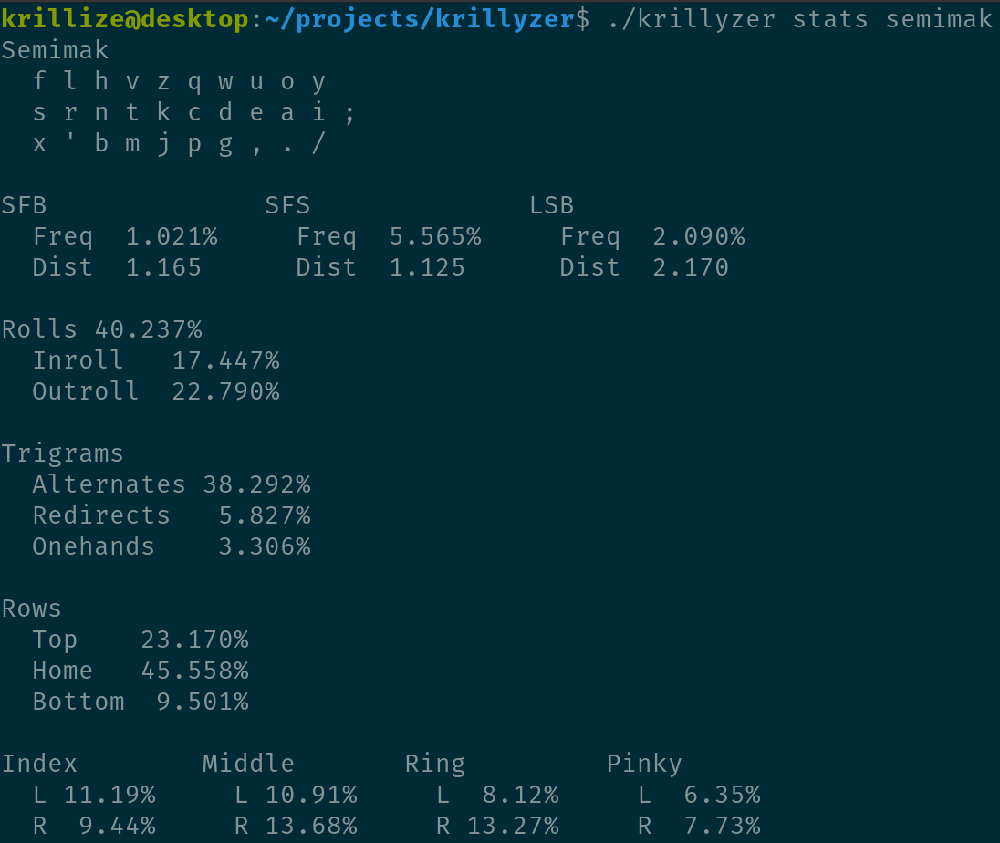

# Krillyzer

# How to use
## Installation
Krillyzer is written in dlang. The compiler can be installed from the [dlang website](https://dlang.org/download.html). You'll also want to make sure you get dlang's package manager [dub](https://github.com/dlang/dub#installation). Once you've installed dub you can run the command dub in the krillyzer folder to compile it and then run the resulting executable.

## Commands

Krillyzer uses [docopt](http://docopt.org/) for its command line spec. In summary:
- the first word on a line is the name of the program
- the second word is the command
- \<word\> is a positional argument
- [--word] is an optional flag
- [--word=value] is an optional flag with a value
- (a | b) means either a or b

## Examples
### list
- `./krillyzer list layouts` (a list of all layouts)
- `./krillyzer list corpora` (a list of all corpora)
- `./krillyzer list stats` (a list of all stats)
- `./krillyzer list layouts --contains=mak` (layouts that contain only the string "mak")

### load
- `./krillyzer load eng/mt/quotes` (sets the corpus to monkeytype quotes)
- `./krillyzer load eng/mt/200` (sets the corpus to monkeytype 200)
- `./krillyzer load sometext.txt --file` (loads from the file "sometext.txt")

### view
- `./krillyzer view semimak` (shows the stats for the layout [semimak](https://semilin.github.io/posts/Semimak.html). It uses the default board defined in [config.txt](https://github.com/krillize/krillyzer/blob/master/config.txt))
- `./krillyzer view semimak --board=rowstag` (shows the stats for semimak with the rowstag board)

### sfb 
- `./krillyzer sfb qwerty` (shows the sfbs per finger and the top 16 most frequent sfbs
- `./krillyzer sfb qwerty --dist` (multiplies each sfb stat by distance)
- `./krillyzer sfb qwerty --amount=32` (shows the top 32 most frequent sfbs)

### stat
- `./krillyzer stat qwerty index-sfb` (shows the frequeny and most common index sfbs on qwerty)
- `./krillyzer stat qwerty sfb --dist` (shows the freq, dist, and weighted frequency of sfbs on qwerty as well as the most common sfbs )
- `./krillyzer stat qwerty one --amount=32` (shows 32 of the most common onehands on qwerty)

### roll
- `./krillyzer roll dvorak` (shows the roll stats for dvorak)
- `./krillyzer roll dvorak --relative` (changes the roll stats to be out of total rolls instead of trigrams)

### use 
- `./krillyzer use mtgap` (shows the per finger use for mtgap)

### find
- `./krillyzer find sfb:l1 sfs:l7` (finds layouts with less than 1% sfb and 7% sfs)
- `./krillyzer find inroll:g30` (finds layouts with greater than 30% inward rolls)
- `./krillyzer find thumb:e0` (finds layouts without any thumb use)
- `./krillyzer find sfb:l0.8 alt roll red one` (finds layouts with less than 0.8% sfb and include alt roll redirect and onehand stat columns)

### sort
- `./krillyzer sort sfb` (sorts all layouts by sfb frequency descending)
- `./krillyzer sort inroll --asc` (sorts all layouts by inroll frequency ascending)

### rank
- `./krillyzer rank` (ranks all layouts according to the [scoring algorithm](#scoring))

### gen
- `./krillyzer gen` (generates a layout that scores well with the [scoring algorithm](#scoring))

### freq 
- `./krillyzer freq lr` (shows the sfb and sfs frequency lr, rl, and the pair)
- `./krillyzer freq th --ignoreCase` (counts Th and tH as th and Ht and hT as ht)

### debug
- `./krillyzer debug graphite br` (shows a bunch of debug information for the bigram "br" on [graphite](https://github.com/rdavison/graphite-layout))
- `./krillyzer debug graphite you` (shows a bunch of debug information for the trigram "you")

## Scoring
Currently, krillyzer uses a very crude scoring metric as a placeholder, simply sfbs and sfs weighted. For this reason the commands "rank" and "gen" are not ready for use.

# Todo
### potential features 
- config option to throw away unknown ngrams
- support for layers
- color display
- shai and "monkeyracer" corpus
- add more stats
- add colstag support
- add generator features like config and trigram stats
- search by finger/sfb/column

### potential stats
- roll ratio
- finger speed
