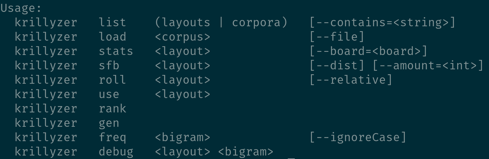

## How to use
### Installation
Krillyzer is written in dlang. The compiler can be installed from the [dlang website](https://dlang.org/download.html). You'll also want to make sure you get dlang's package manager [dub](https://github.com/dlang/dub#installation). Once you've installed dub you can run the command dub in the krillyzer folder to compile it and then run the resulting executable.

### Commands

Krillyzer uses [docopt](http://docopt.org/) for its command line spec. In summary:
- the first word on a line is the name of the program
- the second word is the command
- a \<word\> is a positional argument
- a [--word] is an optional flag
- a [--word=value] is an optional flag with a value
- (a | b) means either a or b 

## Todo
### potential features 
- add more stats
- add sorting by stat
- add colstag support
- add generator features like config and trigram stats

### potential stats
- roll ratio
- center column use
- finger speed

### optimizations
- fix implementation of ngram parsing (currently converts the string to an array to fix utf-8 bug, very slow)
